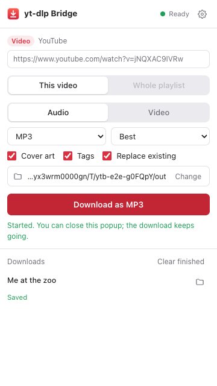

# yt-dlp Bridge

A Chrome extension and a small macOS menu bar app. The extension never downloads anything itself. When you click **Download**, it sends the link and your settings to the menu bar app, and the app runs the `yt-dlp` installed on your Mac.

- Audio (MP3, M4A, Opus, FLAC, ALAC, WAV...) or video (up to 4K, MP4 or MKV)
- Cover art (cropped to a square for music), tags, chapters, subtitles
- Single videos, whole playlists, albums and channels, with an optional item range
- Replace existing files (delete and download again), on by default
- Progress in the popup, on the toolbar badge and in the menu bar, plus a Mac notification at the end
- Downloads keep running after you close the popup or the browser



## How it works

```
Chrome extension  ──POST http://127.0.0.1:41769/api/jobs──▶  menu bar app  ──spawn──▶  yt-dlp  ──▶  ffmpeg
 (all settings)       { url, scope, options }                (queue, tray,                (your install)
                                                              notifications)
```

The app builds the yt-dlp command from a checked list of options. The extension can never send raw command-line flags, and yt-dlp runs without a shell. The settings page shows the exact command for your settings.

## Setup

1. Install the tools once (deno is the JavaScript runtime yt-dlp needs for YouTube):

   ```bash
   brew install yt-dlp ffmpeg deno
   ```

2. Build the menu bar app and move it to Applications:

   ```bash
   cd app && npm install && npm run dist
   ```

   ```bash
   mv "app/dist/mac-arm64/yt-dlp Bridge.app" /Applications/
   ```

   Open **yt-dlp Bridge** from Applications. A download arrow appears in the menu bar. To start it with your Mac, choose **Open at Login** in its menu. For development you can run `npm start` in `app/` instead.

3. Load the extension in Chrome: open `chrome://extensions`, turn on **Developer mode**, click **Load unpacked**, and choose the `extension` folder.

4. The settings page opens. It should say **Connected to the yt-dlp Bridge app**. Pick your save folder and defaults there.

## Using it

- **Popup:** open a video or playlist, click the extension icon, choose *This video* or *Whole playlist*, then **Download**. You can also paste any link into the popup.
- **Right-click** a page or a link: *yt-dlp Bridge → Download* or *Download whole playlist*. The same menu switches between audio and video.
- **Shortcut:** <kbd>⌥</kbd><kbd>⇧</kbd><kbd>D</kbd> downloads the current tab. Change it at `chrome://extensions/shortcuts`.
- **Playlists:** fill **Items** to get only part of one, for example `1-10` or `1,5,9`. Files go into a folder named after the playlist, numbered `001 - Title.mp3`, and the playlist name becomes the album tag.
- **Replace existing files** (on by default) deletes a file that already exists and downloads it again. Turn it off to skip existing files. With it off, you can also turn on the playlist archive, so running a playlist again only gets new videos.

## Settings

All settings live in the extension (`chrome.storage.local`) and are sent with each download.

| Area | Options |
| --- | --- |
| Save location | Folder (native folder picker), file name template, playlist file name template, replace existing files, plain ASCII file names |
| Format | Audio or video, audio format and quality, max video quality, MP4 or MKV, embedded subtitles and languages |
| Cover art and tags | Embed cover, square crop, save cover as .jpg, embed tags, artist from "Artist - Song" titles, playlist as album, chapters |
| Playlists | Skip already downloaded (archive file in the folder) |
| Advanced | Cookies from a browser (age-restricted or private videos), speed limit, SponsorBlock, notifications, use your own yt-dlp config, app port |

The menu bar app has its own small menu: downloads at once (1 to 4), cancel, retry, show in Finder, copy log, update yt-dlp, choose a yt-dlp file, allowed extensions and open at login.

## Security

- The app listens on `127.0.0.1` only and rejects any other `Host` header, which blocks DNS rebinding.
- Web pages are always rejected. Chrome sends `Origin: chrome-extension://<id>` only from extensions, and only on POST, so every call that starts or reads downloads is a POST.
- The bundled extension has a fixed ID (`kdnempddaodnginhpkpilbagmmimkkbg`, set by the `key` in `extension/manifest.json`) and is allowed by default. Any other extension must be allowed once in a native dialog. You can remove allowed extensions in the menu.
- Every option is checked against a fixed list or a strict pattern. File name templates cannot be absolute or contain `..`.

## Troubleshooting

| Problem | Fix |
| --- | --- |
| Popup says "App not running" | Open yt-dlp Bridge from Applications and look for the arrow in the menu bar. |
| "yt-dlp missing" | `brew install yt-dlp`, then menu bar → yt-dlp → Check Again. |
| YouTube errors like `HTTP Error 403` | Update yt-dlp: menu bar → yt-dlp → Update yt-dlp. A failed item in a playlist does not stop the others. |
| macOS asks to access a removable volume | Click Allow. It appears when the app, your shell setup or your save folder is on an external drive. |
| Age-restricted or private video | Settings → Cookies from browser. macOS may ask for Keychain access the first time. |
| Something else | Menu bar → the download → Copy Log. It starts with the exact yt-dlp command. |

## Development

```bash
npm install            # Playwright, used for icons and the end-to-end test
npm test               # app unit and API tests (fake yt-dlp, no network)
npm run e2e            # real app + extension in Chromium + real yt-dlp (needs network)
npm run icons          # re-render all icons from SVG
npm run build:extension  # check the extension, copy it to dist/extension and zip it
```

| Path | What it is |
| --- | --- |
| `extension/` | Manifest V3 extension: popup, settings page, background worker, `lib/` |
| `app/src/options.js` | Option checks and the yt-dlp argument builder |
| `app/src/ytdlp.js` | Finds yt-dlp, ffmpeg and a JS runtime, runs jobs, parses progress |
| `app/src/queue.js` | Download queue |
| `app/src/server.js` | Local API |
| `app/src/main.js` | Electron menu bar, dialogs and notifications |

API (all JSON, `POST` unless noted): `GET|POST /api/status`, `/api/pair`, `/api/jobs`, `/api/jobs/list`, `/api/jobs/clear`, `/api/jobs/:id/{cancel,retry,reveal,log}`, `/api/preview`, `/api/pick-folder`, `/api/open-folder`.
